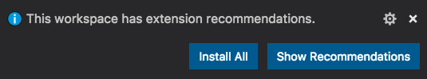
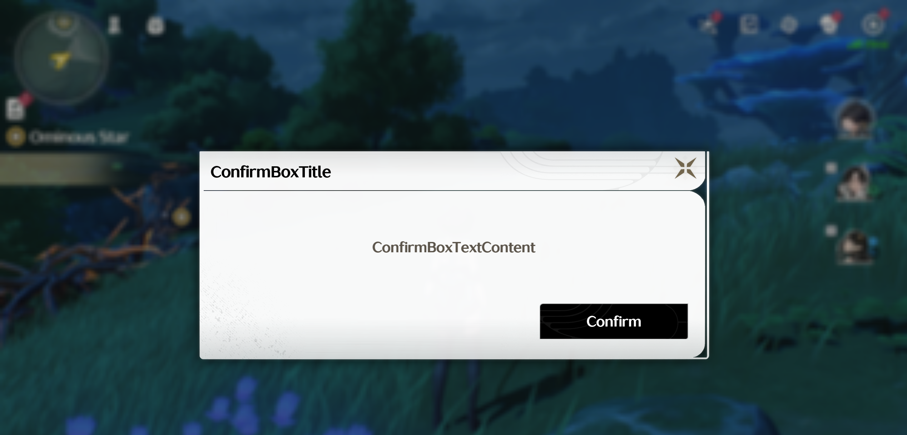

# Wuthering Waves Mod Starter

## Reverse Engineering Process

1. Open `C:\Program Files\Epic Games\WutheringWavesj3oFh\Wuthering Waves Game\Client\Content\Paks` using [Fmodel](https://fmodel.app/download)

2. Under Directory > AES, add AES key: `0x4D65747EDEB74A1DE116B1DD147CF79CD6C082F0DB7908E1BBD37F0428426469` as of patch 1.2.0, see this repository for newer AES keys: [ClostroOffi/wuwa-aes-archive](https://github.com/ClostroOffi/wuwa-aes-archive)

3. Load `pakchunk11-WindowsNoEditor.pak` in Archives menu

4. Under Folders menu, right-click Client folder and choose `Export Folder's Packages Raw Data (.uasset)`

5. Open exported folder with VS Code

6. Explore code

## How to Develop Mods

1. `npm install`

2. Create a new folder under `development` that will hold your modified code

    i. `mkdir development/WutheringWaves-NewMod`

2. Copy over or create folders and files that will be modified

    i. Copy folders and files from the exported folder from step 5 of [Reverse Engineering Process](#reverse-engineering-process)

    ii. For example, if `InputController.js` is being modified, then add the folders `Client/Aki/Javascript/Game/Input` leading up to `InputController.js` under `WutheringWaves-NewMod`

    iii. Use the existing `WutheringWaves-MenuWithText` inside `development` as reference

4. Format minified `.js` files with one of the following:

    i. <kbd>Ctrl</kbd> + <kbd>Shift</kbd> + <kbd>P</kbd> then select `Format Document` and choose Biome

    ii. <kbd>Shift</kbd> + <kbd>Alt</kbd> + <kbd>F</kbd> inside VS Code

    iii. Run `npx @biomejs/biome format --write .`

> [!NOTE]
> Formatting with biome requires recommended extensions

5. Modify `.js` files

6. Repack modified code using one of the following:

    i. `npm run convertToPak`, which will take all folders under `development` and convert each folder into a `.pak` file under `~mods`

    ii. Drag and drop folder, e.g. `WutheringWaves-NewMod` into `UnrealPak-Without-Compression.bat`

    iii. `~mods` folder should now contain `WutheringWaves-NewMod.pak`

## How to Install Mods

1. Copy `~mods` folder over to `\Wuthering Waves\Wuthering Waves Game\Client\Content\Paks\`

2. Find `Wuthering Waves\Wuthering Waves Game\Client\Binaries\Win64\Client-Win64-Shipping.exe`

3. Right-click and create shortcut

4. Right-click new shortcut and choose Properties

5. Change target to be `"C:\Program Files\Epic Games\WutheringWavesj3oFh\Wuthering Waves Game\Client\Binaries\Win64\Client-Win64-Shipping.exe" -fileopenlog -SkipSplash`

5. Open the game with either:

    i. New shortcut

    ii. [wuwa_modloader](https://github.com/Sehyn/wuwa_modloader)

## Example Mod

Under `WutheringWaves-MenuWithText`, is an example mod that displays the basics of showing a menu

